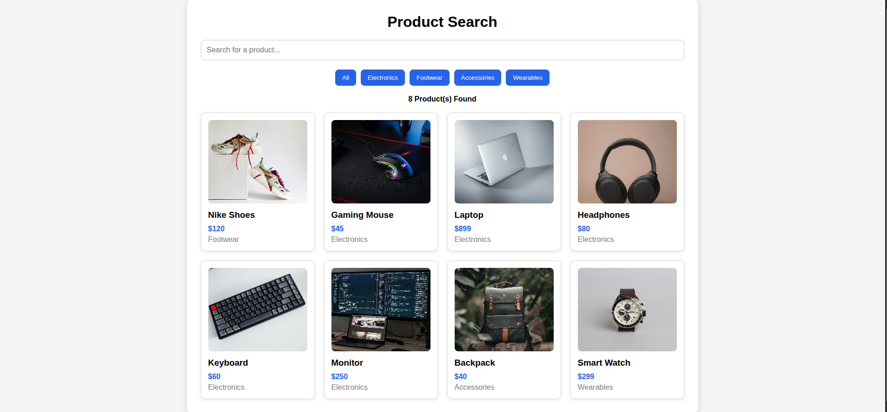

# Dynamic Filtering App

A simple web application that allows users to search and filter products dynamically using JavaScript.

## Live Demo

https://khuwu.github.io/dynamic-filtering-app/

## Features

- Search products by name
- Filter products by category
- Responsive product layout
- Displays the number of matching products
- Shows a "No products found" message when there are no matches

## Built With

- HTML5
- CSS3
- JavaScript (ES6)

## Concepts Practiced

- Arrays and Objects
- DOM Manipulation
- Event Listeners
- Arrow Functions
- Array Methods (`filter()` and `forEach()`)
- Template Literals
- Dynamic Rendering

## Folder Structure

```
dynamic-filtering-app/
│
├── index.html
├── style.css
├── script.js
├── README.md
└── images/
```

## Screenshots

### Home Page



### Filtered Results


## How to Run

1. Clone this repository.
2. Open the project folder.
3. Open `index.html` in your browser.

## Author

**Khushi Thami**

Frontend Development Internship Project